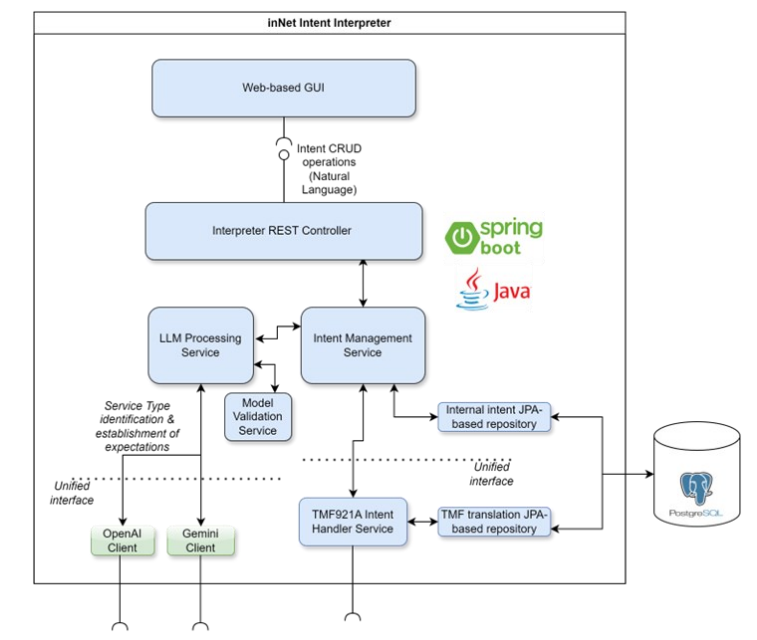
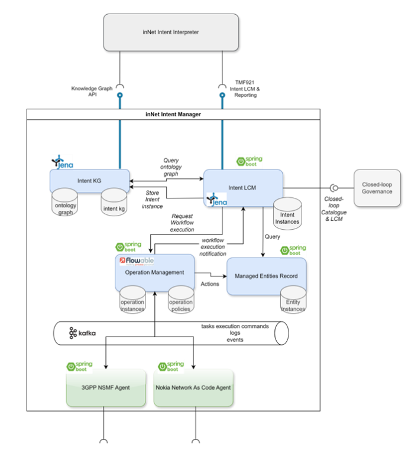
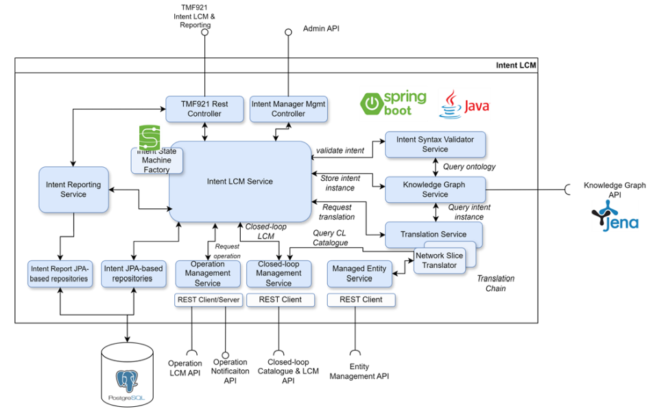
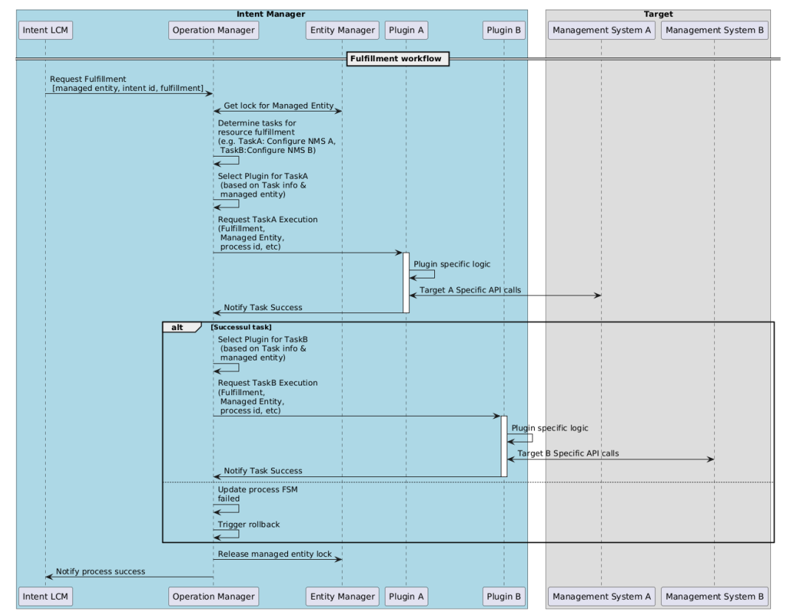
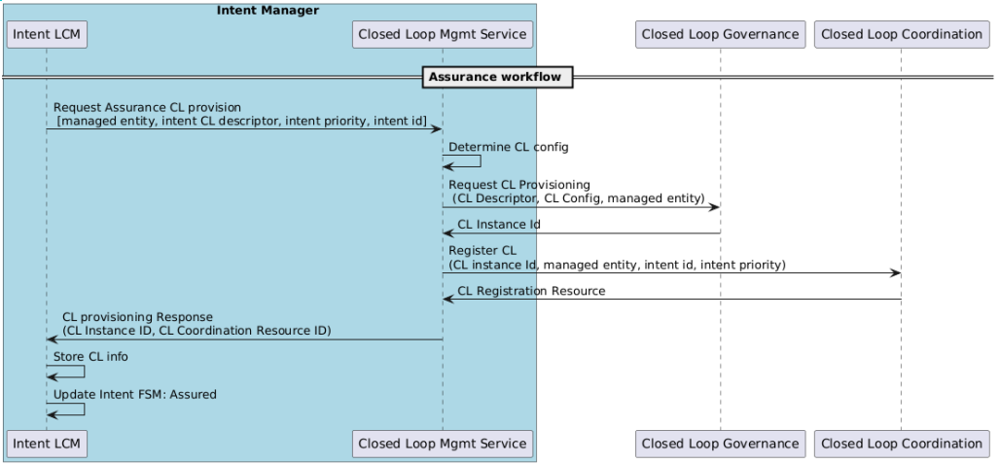
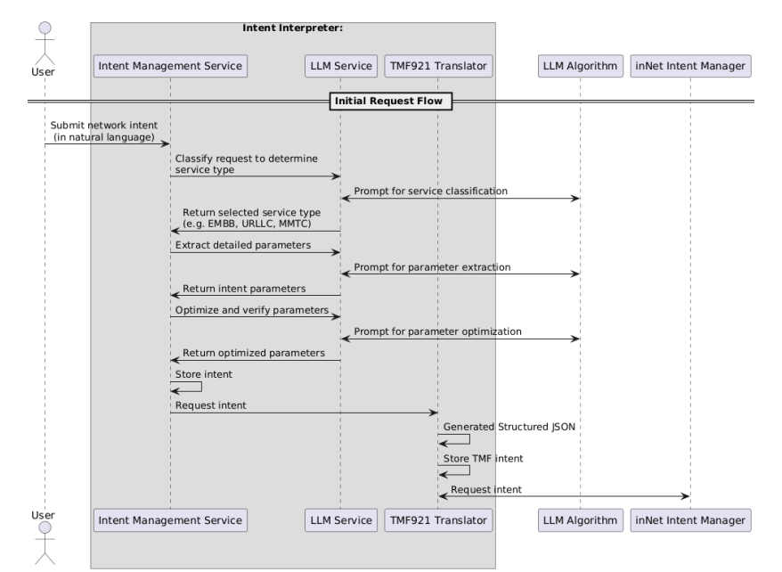

# inNet — Intent-Based Network Management Tool

[](https://www.tmforum.org/oda/open-apis/directory/intent-management-api-TMF921/v5.0)

> **inNet** is an intent-driven network management tool designed to implement the **TM Forum's TMF921 Intent Management API**. It enables autonomous management of network resources across the **cloud-edge continuum**, ensuring efficient resource allocation, and dynamic resource and service level adaptations..

---

## Table of Contents
- [Overview](#overview)
- [Architecture](#architecture)
  - [1) Intent Interpreter](#1-intent-interpreter)
  - [2) Intent Manager](#2-intent-manager)
  - [3) Closed-loop Governance](#3-closed-loop-governance)
- [Workflows](#workflows)
- [APIs (TMF921 v5)](#apis-tmf921-v5)
- [Natural Language -> Intent](#natural-language-to-intent)
- [PoC Validation](#poc-validation)
- [Contact](#contact)
- [Acknowledgements](#acknowledgements)
---

## Overview
**inNet** lets users express high-level connectivity goals (e.g., *“ultra-low latency, high bandwidth in area X”*) in **natural language** and turns them into **TMF921** intents that the platform validates, fulfils (e.g., 3GPP slice instantiation), and continuously **assures** via closed-control loops.

Key capabilities:
- **TMF921-compliant intent lifecycle** (create, get, modify, terminate).
- **Ontology-backed** validation with a **Knowledge Graph**.
- **BPMN-driven** fulfillment via pluggable operation plugins.
- **Closed-loop assurance** (monitor, analyze, decide, execute).

> 

> *Figure: High-level components and tool interfaces.*

---

## Architecture

### 1) Intent Interpreter
Web UI + backend service that turns **natural language** into **structured intents** using LLMs (OpenAI/Gemini). Produces TMF921 JSON-LD and hands off to the Intent Manager.

- Web GUI (HTML/JS)
- REST Controller (Spring Boot)
- LLM Processing & Model Validation (Spring AI)
- TMF921A Handler (encodes JSON-LD)

> 

> *Figure: Intent Interpreter.*


### 2) Intent Manager
Core **TMF921** service implementing:
- **Intent LCM** (FSM with extended intermediate states)
- **Syntax & Ontology Validation** (RDF/JSON-LD)
- **Translation Service** (intents -> managed entities + assurance policies)
- **Knowledge Graph Service** (Apache Jena/Fuseki)
- **Operation Manager** (Flowable BPMN processes + plugins)
- **(Upcoming)** Intent Reports

> 

> *Figure: Intent Manager.*

> 

> *Figure: Intent LCM.*

### 3) Closed-loop Governance
Provisioning/Lifecycle of **assurance loops** leveraging a **catalog** of monitoring, analysis, decision, and execution functions (deployable e.g., via Helm). Supports reactive and predictive loops.

> 

> *Figure: Intent Closed Loop.*

---

## Workflows

**Provisioning (end-to-end)**  
1. **Validate** intent against ontology  
2. **Fulfillment** via BPMN plugins  
3. **Assurance** loop instantiation

> 

> *Figure: Intent Provisioning Workflow.*

**Fulfillment**  
- Policy selects BPMN process; Flowable delegates call the correct **plugin** (e.g., 3GPP NSMF) to create/update resources.

> 

> *Figure: Intent Fulfillment Workflow.*

**Assurance**  
- Monitoring -> Analysis (optionally ML) -> Decision -> Execution; loop notifies governance and the Intent LCM as needed.

> 

> *Figure: Intent Assurance Workflow.*

**Interpreter Sequence**  
- Classify service (eMBB/URLLC/mMTC) -> Extract parameters -> Optimize parameters -> Emit JSON-LD.

> 

> *Figure: Intent Interpreter Workflow.*

---

## APIs (TMF921 v5)

- TMF official spec: https://www.tmforum.org/oda/open-apis/directory/intent-management-api-TMF921/v5.0

> Base path:
```
/tmf-api/intentManagement/v5
```

**Resources**
- `POST /intents/create` — create intent
- `GET /intents/{id}` — retrieve intent
- `GET /intents` — retrieve all intents
- `POST /intents/{id}/modify` — update/modify intent
- `DELETE /intents/{id}` — terminate intent

**Create Intent — Example**
```http
POST /tmf-api/intentManagement/v5/intents/create
Content-Type: application/ld+json

{
  "@context": "https://tmforum.org/tmf921/context",
  "@type": "Intent",
  "name": "HighBW-LowLatency-eMBB",
  "priority": "high",
  "expectation": [
    {
      "@type": "PropertyExpectation",
      "name": "peak_data_rate",
      "targetValue": "high",
      "operator": "atLeast"
    },
    {
      "@type": "PropertyExpectation",
      "name": "downlink_latency",
      "targetValue": "1",
      "unit": "ms",
      "operator": "smaller"
    },
    {
      "@type": "DeliveryExpectation",
      "name": "availability",
      "targetValue": "95%",
      "operator": "atMost"
    }
...
  ]
}

```

**Natural Language to Intent**
--

The Interpreter uses LLM prompts to:

* Classify requested service: `eMBB | URLLC | mMTC`

* Extract key parameters (latency, jitter, throughput, availability, reliability, density, area, etc.)

* Optimize parameters for feasibility/consistency


**PoC Validation**
--

Validated features:

Interpreter: natural language -> JSON-LD intent

TMF921 conformance in creation/termination paths

Fulfillment: BPMN workflow -> 3GPP NST lookup & instantiation

Assurance: closed-loop integration (emulated metrics to trigger loop)

**Contact**
--

For support or inquiries, reach out via:
* j.brenes@nextworks.it
* m.kolobov@nextworks.it

**Acknowledgements**
--

This work is part of the INTEND project (EU Horizon Europe, GA 101135576).
