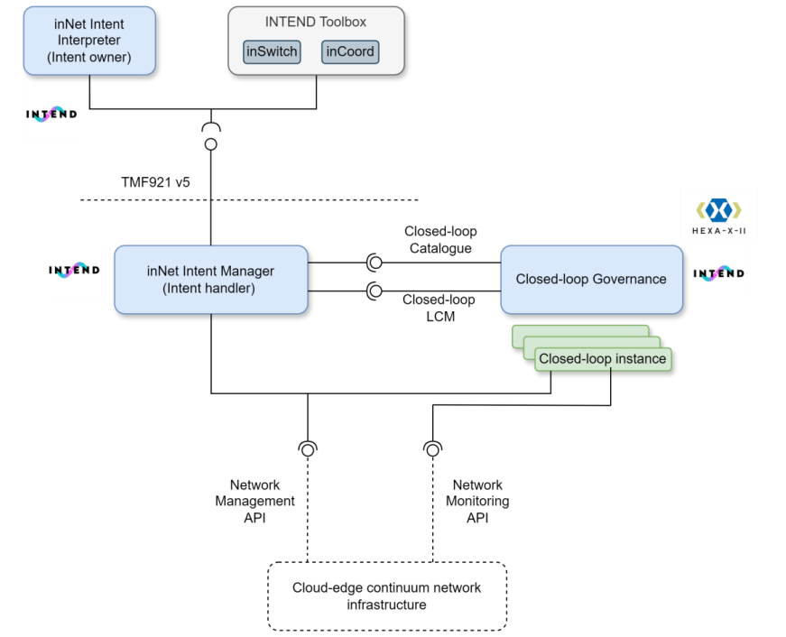
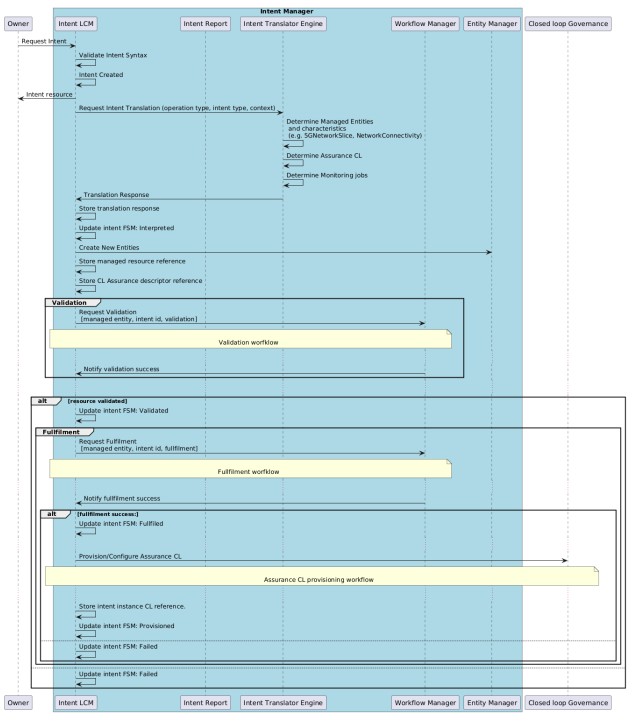

# inNet — Intent-Based Network Management Tool

> **inNet** is an intent-driven network management tool designed to implement the **TM Forum's TMF921 Intent Management API**. It enables autonomous management of network resources across the **cloud-edge continuum**, ensuring efficient resource allocation, and dynamic resource and service level adaptations..

---

## Table of Contents
- [Overview](#overview)
- [Architecture](#architecture)
- [Workflows](#workflows)
- [APIs (TMF921 v5)](#apis-tmf921-v5)
- [Natural Language -> Intent](#natural-language-to-intent)
- [Contact](#contact)
- [Acknowledgements](#acknowledgements)
---

## Overview
**inNet** lets users express high-level connectivity goals (e.g., *“ultra-low latency, high bandwidth in area X”*) in **natural language** and turns them into **TMF921** intents that the platform validates, fulfils (e.g., 3GPP slice instantiation), and continuously **assures** via closed-control loops.

Key capabilities:
- **TMF921-compliant intent lifecycle** (create, get, modify, terminate).
- **Ontology-backed** validation with a **Knowledge Graph**.
- **BPMN-driven** fulfillment via pluggable operation plugins.
- **Closed-loop assurance** (monitor, analyze, decide, execute).

---

## Architecture

> 

> *Figure: High-level components and tool interfaces.*

---

## Workflows

**Provisioning (end-to-end)**  
1. **Validate** intent against ontology  
2. **Fulfillment** via BPMN plugins  
3. **Assurance** loop instantiation

> 

> *Figure: Intent Provisioning Workflow.*

---

## APIs (TMF921 v5)

- TMF official spec: https://www.tmforum.org/oda/open-apis/directory/intent-management-api-TMF921/v5.0

> Base path: `/tmf-api/intentManagement/v5`

**Resources**
- `POST /intents/create` — create intent
- `GET /intents/{id}` — retrieve intent
- `GET /intents` — retrieve all intents
- `POST /intents/{id}/modify` — update/modify intent
- `DELETE /intents/{id}` — terminate intent

**Create Intent — Example**

> 

> *Figure: JSON-LD Intent.*

**Natural Language to Intent**
--

The Interpreter uses LLM prompts to:

* Classify requested service: `eMBB | URLLC | mMTC`

* Extract key parameters (latency, jitter, throughput, availability, reliability, density, area, etc.)

* Optimize parameters for feasibility/consistency

**Contact**
--

For support or inquiries, reach out via:
* j.brenes@nextworks.it
* m.kolobov@nextworks.it

**Acknowledgements**
--

This work is part of the INTEND project (EU Horizon Europe, GA 101135576).
