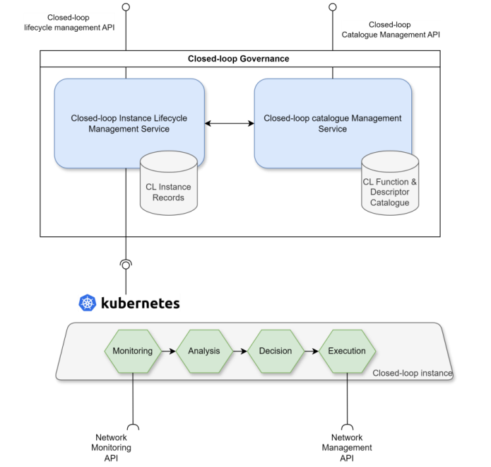
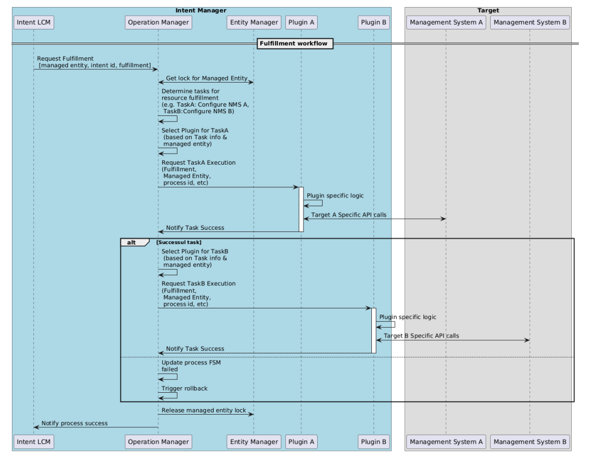
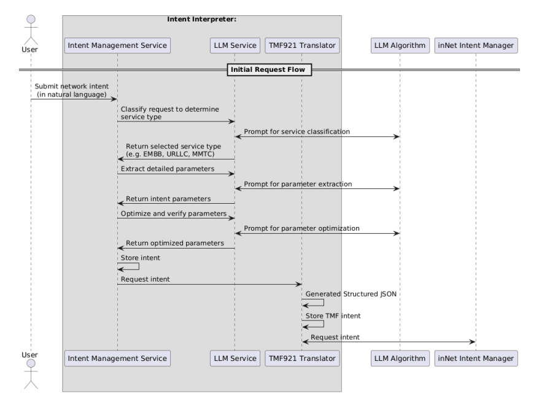

## inNet 
The **inNet tool** is built on a **modular, standards-oriented architecture** to support **intent-based network resource management** across the **computing continuum**.

### Key Features
- Enables network intent based management through a **TMF921** complaint REST interface
- Enables expression of **high-level network requirements** using **natural language inputs**.
- Automated validation and fulfilment workflow execution
- Customization through plugin-based approach for network infrastructure management
- Configurable policies for mapping resource to validation and fulfilment workflows using BPMN files
  
  
### Architecture
For more details we refer to D2-1 [] 
#### Main Components
1. **Internal Intent Interpreter**  
2. **Intent Manager**  
3. **Closed-loop Governance**

### 1) Intent Interpreter
Web UI + backend service that turns **natural language** into **structured intents** using LLMs (OpenAI/Gemini). Produces TMF921 JSON-LD and hands off to the Intent Manager.

- Web GUI (HTML/JS)
- REST Controller (Spring Boot)
- LLM Processing & Model Validation (Spring AI)
- TMF921A Handler (encodes JSON-LD)

> 

> *Figure: Intent Interpreter.*

### 2) Intent Manager
Core **TMF921** service implementing:
- **Intent LCM** (FSM with extended intermediate states)
- **Syntax & Ontology Validation** (RDF/JSON-LD)
- **Translation Service** (intents -> managed entities + assurance policies)
- **Knowledge Graph Service** (Apache Jena/Fuseki)
- **Operation Manager** (Flowable BPMN processes + plugins)
- **(Upcoming)** Intent Reports

> 

> *Figure: Intent Manager.*

> 

> *Figure: Intent LCM.*

### 3) Closed-loop Governance
Provisioning/Lifecycle of **assurance loops** leveraging a **catalog** of monitoring, analysis, decision, and execution functions (deployable e.g., via Helm). Supports reactive and predictive loops.

> 

> *Figure: Intent Closed Loop.*

**Fulfillment**  
- Policy selects BPMN process; Flowable delegates call the correct **plugin** (e.g., 3GPP NSMF) to create/update resources.

> 

> *Figure: Intent Fulfillment Workflow.*

**Assurance**  
- Monitoring -> Analysis (optionally ML) -> Decision -> Execution; loop notifies governance and the Intent LCM as needed.

> 

> *Figure: Intent Assurance Workflow.*

**Interpreter Sequence**  
- Classify service (eMBB/URLLC/mMTC) -> Extract parameters -> Optimize parameters -> Emit JSON-LD.

> 

> *Figure: Intent Interpreter Workflow.*
